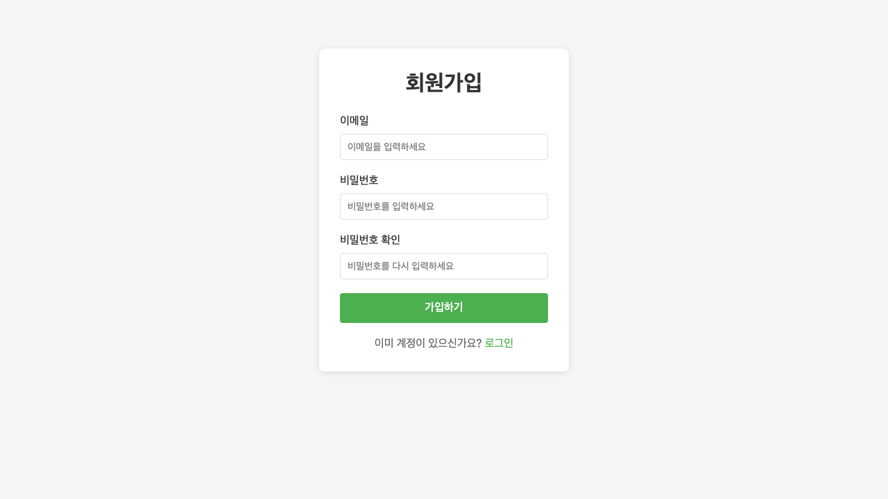
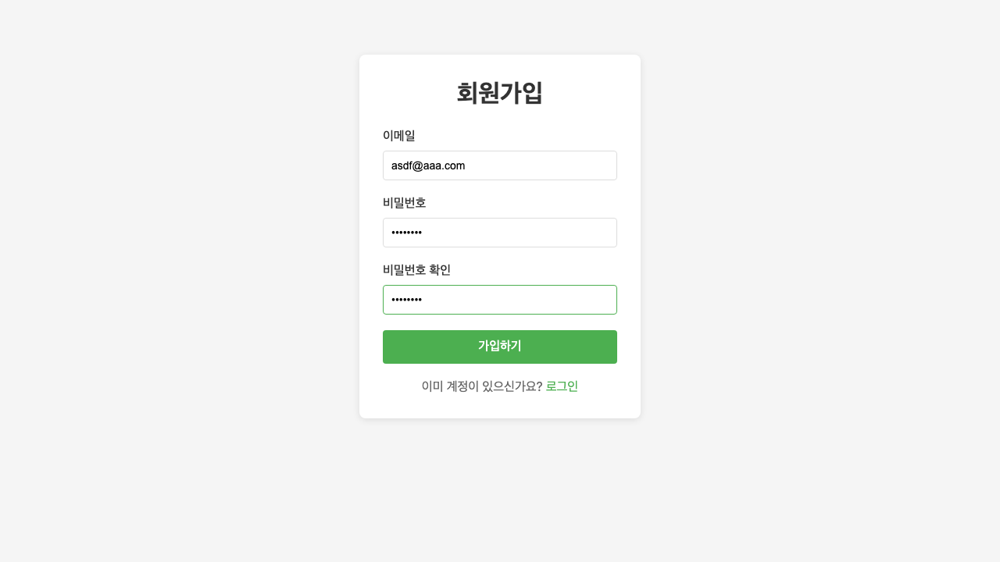
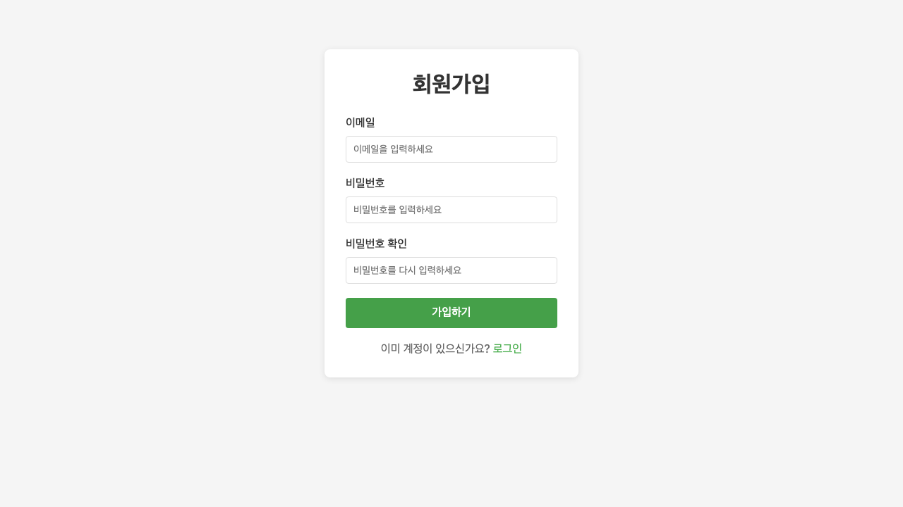
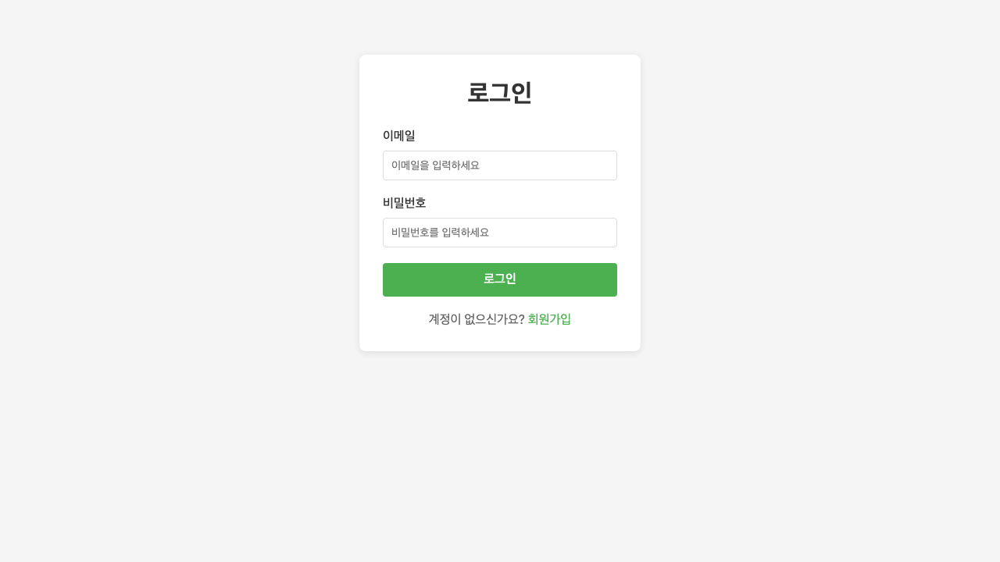
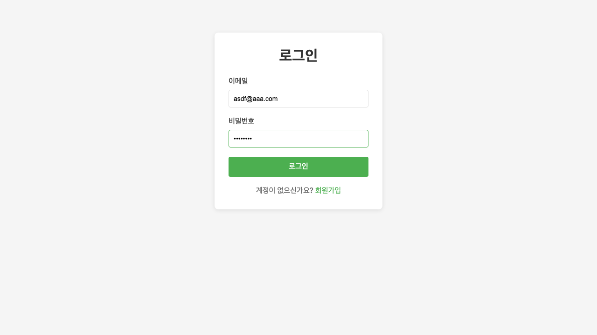
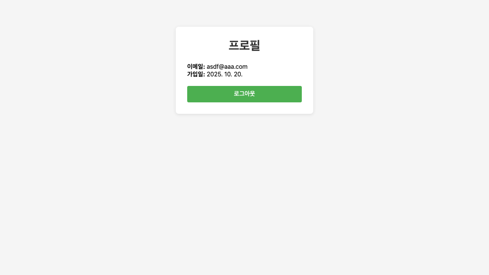
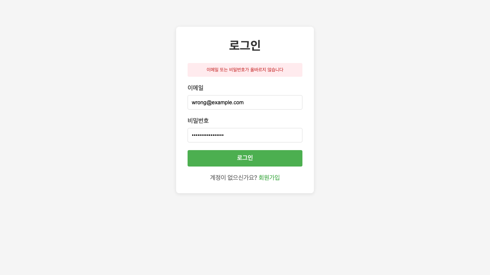
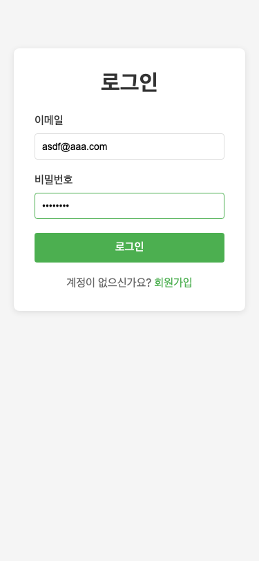

# 프로젝트 4: 로그인/회원가입 폼

## 📸 프로젝트 스크린샷

### 1. 회원가입 페이지 - 빈 상태


### 2. 회원가입 페이지 - 입력 완료


### 3. 회원가입 - 비밀번호 불일치 에러


### 4. 로그인 페이지 - 빈 상태


### 5. 로그인 페이지 - 입력 완료


### 6. 프로필 페이지 (로그인 후)


### 7. 로그인 실패 - 에러 메시지


### 8. 모바일 화면 - 회원가입


### 9. 모바일 화면 - 로그인


---

## 📋 프로젝트 개요

**난이도**: ⭐⭐ 초중급  
**개발 시간**: 2-3일  
**Playwright 학습 효과**: ⭐⭐⭐⭐  
**실무 유사도**: ⭐⭐⭐⭐⭐

## 🎯 학습 목표

이 프로젝트를 통해 다음을 학습합니다:
- 폼 검증 테스트
- 인증 플로우 (JWT)
- 쿠키 관리
- 페이지 리다이렉트

## 🛠 기술 스택

- **Frontend**: Svelte + SvelteKit
- **Backend**: Express + JWT
- **Database**: SQLite (개발용)
- **검증**: Zod

## ✨ 주요 기능 요구사항

### 1. 회원가입 (Sign Up)

#### 입력 필드
- **이메일**: 
  - 이메일 형식 검증
  - 중복 확인
  - 실시간 검증 피드백
- **비밀번호**:
  - 최소 8자 이상
  - 영문, 숫자, 특수문자 각 1개 이상 포함
  - 강도 표시 (약함/보통/강함)
- **비밀번호 확인**:
  - 비밀번호와 일치 여부 검증

#### 검증 규칙
```typescript
const signupSchema = z.object({
  email: z.string().email('유효한 이메일을 입력하세요'),
  password: z.string()
    .min(8, '비밀번호는 최소 8자 이상이어야 합니다')
    .regex(/[A-Za-z]/, '영문자를 포함해야 합니다')
    .regex(/[0-9]/, '숫자를 포함해야 합니다')
    .regex(/[^A-Za-z0-9]/, '특수문자를 포함해야 합니다'),
  confirmPassword: z.string()
}).refine(data => data.password === data.confirmPassword, {
  message: '비밀번호가 일치하지 않습니다',
  path: ['confirmPassword']
});
```

#### 회원가입 플로우
1. 폼 입력
2. 클라이언트 검증
3. 서버 검증
4. 사용자 생성 (비밀번호 해싱)
5. 성공 메시지 표시
6. 로그인 페이지로 리다이렉트

### 2. 로그인 (Sign In)

#### 입력 필드
- **이메일**: 이메일 형식 검증
- **비밀번호**: 필수 입력
- **자동 로그인**: 체크박스 (선택사항)

#### 로그인 플로우
1. 이메일/비밀번호 입력
2. 서버로 인증 요청
3. JWT 토큰 발급
4. 쿠키에 토큰 저장 (httpOnly)
5. 프로필 페이지로 리다이렉트

#### 에러 처리
- **잘못된 이메일/비밀번호**: "이메일 또는 비밀번호가 올바르지 않습니다"
- **계정 없음**: "등록되지 않은 이메일입니다"
- **네트워크 오류**: "서버에 연결할 수 없습니다"

### 3. 프로필 페이지 (인증 필요)

#### 표시 정보
- 사용자 이메일
- 가입일
- 로그아웃 버튼

#### 접근 제어
- JWT 토큰 검증
- 토큰 없으면 로그인 페이지로 리다이렉트
- 만료된 토큰 처리

### 4. 로그아웃

#### 로그아웃 플로우
1. 로그아웃 버튼 클릭
2. 쿠키에서 토큰 삭제
3. 로그인 페이지로 리다이렉트
4. 브라우저 히스토리 관리 (뒤로가기 방지)

### 5. 보안 기능

- **비밀번호 해싱**: bcrypt 사용
- **JWT 토큰**: 
  - 만료 시간 설정 (1시간)
  - httpOnly 쿠키로 저장
  - CSRF 토큰 (선택사항)
- **Rate Limiting**: 로그인 시도 제한 (선택사항)
- **XSS 방지**: 입력값 새니타이징

## 🎨 UI/UX 요구사항

### 회원가입 페이지
```
┌────────────────────────────────────┐
│  회원가입                           │
├────────────────────────────────────┤
│  이메일                             │
│  [........................]         │
│  ✓ 사용 가능한 이메일입니다         │
│                                    │
│  비밀번호                           │
│  [........................] 👁     │
│  강도: ████████░░ 강함             │
│                                    │
│  비밀번호 확인                      │
│  [........................] 👁     │
│  ✓ 비밀번호가 일치합니다            │
│                                    │
│  [    가입하기    ]                │
│                                    │
│  이미 계정이 있으신가요? 로그인     │
└────────────────────────────────────┘
```

### 로그인 페이지
```
┌────────────────────────────────────┐
│  로그인                             │
├────────────────────────────────────┤
│  이메일                             │
│  [........................]         │
│                                    │
│  비밀번호                           │
│  [........................] 👁     │
│                                    │
│  ☐ 자동 로그인                     │
│                                    │
│  [    로그인    ]                  │
│                                    │
│  계정이 없으신가요? 회원가입        │
│  비밀번호를 잊으셨나요?             │
└────────────────────────────────────┘
```

## 🔧 백엔드 API

### 1. 회원가입 API
```
POST /api/auth/signup
Content-Type: application/json

{
  "email": "user@example.com",
  "password": "Password123!"
}

Response (201):
{
  "message": "회원가입이 완료되었습니다",
  "user": {
    "id": 1,
    "email": "user@example.com"
  }
}

Error (400):
{
  "error": "이미 등록된 이메일입니다"
}
```

### 2. 로그인 API
```
POST /api/auth/login
Content-Type: application/json

{
  "email": "user@example.com",
  "password": "Password123!"
}

Response (200):
{
  "message": "로그인 성공",
  "token": "eyJhbGciOiJIUzI1NiIsInR5cCI6IkpXVCJ9...",
  "user": {
    "id": 1,
    "email": "user@example.com"
  }
}

Set-Cookie: auth-token=eyJhbG...; HttpOnly; Secure; SameSite=Strict

Error (401):
{
  "error": "이메일 또는 비밀번호가 올바르지 않습니다"
}
```

### 3. 프로필 조회 API
```
GET /api/auth/profile
Cookie: auth-token=eyJhbG...

Response (200):
{
  "user": {
    "id": 1,
    "email": "user@example.com",
    "createdAt": "2025-01-01T00:00:00Z"
  }
}

Error (401):
{
  "error": "인증이 필요합니다"
}
```

### 4. 로그아웃 API
```
POST /api/auth/logout
Cookie: auth-token=eyJhbG...

Response (200):
{
  "message": "로그아웃 되었습니다"
}

Set-Cookie: auth-token=; HttpOnly; Expires=Thu, 01 Jan 1970 00:00:00 GMT
```

## 🧪 Playwright 테스트 시나리오

### 1. 회원가입 → 로그인 → 프로필 전체 플로우
```typescript
test('회원가입 → 로그인 → 프로필 전체 플로우', async ({ page }) => {
  // 1. 회원가입 페이지
  await page.goto('http://localhost:5173/signup');
  
  const timestamp = Date.now();
  const email = `test${timestamp}@example.com`;
  
  await page.fill('input[name="email"]', email);
  await page.fill('input[name="password"]', 'Password123!');
  await page.fill('input[name="confirmPassword"]', 'Password123!');
  await page.click('button:has-text("가입하기")');
  
  // 2. 성공 메시지 및 리다이렉트
  await expect(page.locator('.success')).toHaveText('가입 완료!');
  await expect(page).toHaveURL(/.*\/login/);
  
  // 3. 로그인
  await page.fill('input[name="email"]', email);
  await page.fill('input[name="password"]', 'Password123!');
  await page.click('button:has-text("로그인")');
  
  // 4. 프로필 페이지로 리다이렉트
  await expect(page).toHaveURL(/.*\/profile/);
  await expect(page.locator('text=' + email)).toBeVisible();
});
```

### 2. 비밀번호 검증 테스트
```typescript
test('비밀번호 검증', async ({ page }) => {
  await page.goto('http://localhost:5173/signup');
  
  // 짧은 비밀번호
  await page.fill('input[name="password"]', '123');
  await page.blur('input[name="password"]');
  
  await expect(page.locator('.error'))
    .toHaveText('비밀번호는 최소 8자 이상이어야 합니다');
  
  // 숫자/특수문자 없음
  await page.fill('input[name="password"]', 'abcdefgh');
  await page.blur('input[name="password"]');
  
  await expect(page.locator('.error'))
    .toContainText('숫자와 특수문자를 포함해야 합니다');
});
```

### 3. 로그인 실패 테스트
```typescript
test('로그인 실패 - 잘못된 비밀번호', async ({ page }) => {
  await page.goto('http://localhost:5173/login');
  
  await page.fill('input[name="email"]', 'test@example.com');
  await page.fill('input[name="password"]', 'WrongPassword');
  await page.click('button:has-text("로그인")');
  
  await expect(page.locator('.error'))
    .toHaveText('이메일 또는 비밀번호가 올바르지 않습니다');
});
```

### 4. 인증 필요 페이지 접근 제한 테스트
```typescript
test('인증 필요 페이지 접근 제한', async ({ page }) => {
  // 로그인 없이 프로필 페이지 접근
  await page.goto('http://localhost:5173/profile');
  
  // 로그인 페이지로 리다이렉트
  await expect(page).toHaveURL(/.*\/login/);
  await expect(page.locator('.message'))
    .toHaveText('로그인이 필요합니다');
});
```

### 5. 로그아웃 테스트
```typescript
test('로그아웃', async ({ page, context }) => {
  // 로그인
  await page.goto('http://localhost:5173/login');
  await page.fill('input[name="email"]', 'test@example.com');
  await page.fill('input[name="password"]', 'Password123!');
  await page.click('button:has-text("로그인")');
  
  // 쿠키 확인
  const cookies = await context.cookies();
  const authCookie = cookies.find(c => c.name === 'auth-token');
  expect(authCookie).toBeDefined();
  
  // 로그아웃
  await page.click('button:has-text("로그아웃")');
  
  // 로그인 페이지로 리다이렉트
  await expect(page).toHaveURL(/.*\/login/);
  
  // 쿠키 삭제 확인
  const cookiesAfter = await context.cookies();
  const authCookieAfter = cookiesAfter.find(c => c.name === 'auth-token');
  expect(authCookieAfter).toBeUndefined();
});
```

## 📁 프로젝트 구조

```
04-auth-form/
├── src/
│   ├── routes/
│   │   ├── +page.svelte           # 홈
│   │   ├── signup/
│   │   │   └── +page.svelte       # 회원가입
│   │   ├── login/
│   │   │   └── +page.svelte       # 로그인
│   │   └── profile/
│   │       └── +page.svelte       # 프로필
│   ├── lib/
│   │   ├── components/
│   │   │   ├── Input.svelte       # 입력 필드
│   │   │   ├── Button.svelte      # 버튼
│   │   │   └── PasswordStrength.svelte  # 비밀번호 강도
│   │   ├── stores/
│   │   │   └── auth.ts            # 인증 스토어
│   │   ├── utils/
│   │   │   ├── validation.ts      # Zod 스키마
│   │   │   └── api.ts             # API 호출
│   │   └── types/
│   │       └── auth.ts            # 타입 정의
├── server/
│   ├── index.js                   # Express 서버
│   ├── routes/
│   │   └── auth.js                # 인증 라우트
│   ├── middleware/
│   │   └── auth.js                # JWT 검증
│   ├── models/
│   │   └── User.js                # 사용자 모델
│   └── db/
│       └── database.sqlite        # SQLite DB
├── tests/
│   ├── auth.spec.ts
│   └── fixtures/
│       └── users.ts
├── playwright.config.ts
├── package.json
└── README.md
```

## 📊 데이터 모델

### User 모델
```typescript
interface User {
  id: number;
  email: string;
  passwordHash: string;
  createdAt: Date;
  updatedAt: Date;
}
```

### JWT Payload
```typescript
interface JWTPayload {
  userId: number;
  email: string;
  iat: number;  // issued at
  exp: number;  // expires
}
```

## 🚀 시작하기

### 1. 프로젝트 생성
```bash
npm create svelte@latest 04-auth-form
cd 04-auth-form
npm install
```

### 2. 의존성 설치

**Frontend:**
```bash
npm install zod
```

**Backend:**
```bash
npm install express jsonwebtoken bcrypt sqlite3
npm install -D @types/express @types/jsonwebtoken @types/bcrypt
```

**Playwright:**
```bash
npm install -D @playwright/test
npx playwright install
```

### 3. 환경 변수 설정
`.env` 파일 생성:
```env
JWT_SECRET=your-secret-key-here
JWT_EXPIRES_IN=1h
DATABASE_PATH=./server/db/database.sqlite
```

### 4. 서버 실행
```bash
# 백엔드 서버
node server/index.js

# SvelteKit 개발 서버
npm run dev
```

### 5. 테스트 실행
```bash
npx playwright test
```

## ✅ 완료 체크리스트

### 기능 구현
- [x] 회원가입 폼
- [x] 로그인 폼
- [x] 비밀번호 검증
- [x] 이메일 중복 확인
- [x] JWT 토큰 발급
- [x] 쿠키 관리
- [x] 프로필 페이지
- [x] 로그아웃
- [x] 인증 미들웨어

### 테스트 작성
- [x] 회원가입 테스트
- [x] 로그인 테스트
- [x] 비밀번호 검증 테스트
- [x] 인증 플로우 테스트
- [x] 쿠키 관리 테스트
- [x] 리다이렉트 테스트

### 보안
- [x] 비밀번호 해싱 (bcrypt)
- [x] JWT httpOnly 쿠키
- [x] XSS 방지
- [ ] CSRF 방지 (선택사항)

## 💡 추가 개선 아이디어

### 기본
- [ ] 비밀번호 찾기 (이메일 인증)
- [ ] 이메일 인증
- [ ] 소셜 로그인 (Google, GitHub)

### 중급
- [ ] 2단계 인증 (2FA)
- [ ] 프로필 수정
- [ ] 비밀번호 변경
- [ ] 계정 삭제

### 고급
- [ ] OAuth 2.0 구현
- [ ] Refresh Token
- [ ] 세션 관리
- [ ] 디바이스 관리

## 📚 참고 자료

- [SvelteKit 공식 문서](https://kit.svelte.dev/)
- [JWT 공식 사이트](https://jwt.io/)
- [Zod 문서](https://zod.dev/)
- [bcrypt 문서](https://github.com/kelektiv/node.bcrypt.js)
